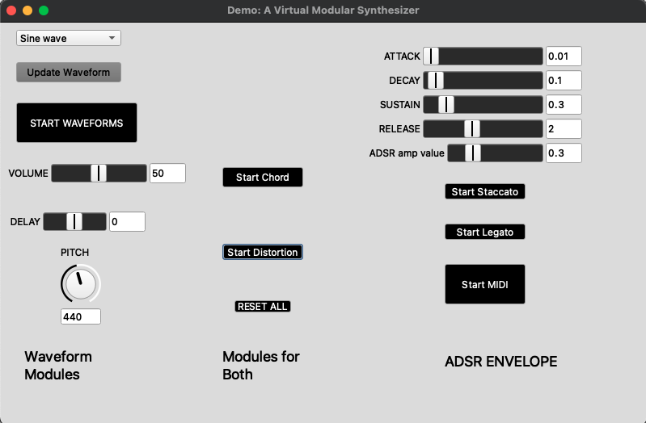

# Virtual Modular Synthesizer

> This is a virtual modular synthesizer aimed to accept both synthesized sound waves and MIDI as input option, and output desired sound modifications.

This is a virtual modular synthesizer built in the domain-specific language SuperCollider. It is meant to accept both sound waves which are natively played in SuperCollider's server, and MIDI. Sound modifications can then be made to the chosen input option.

## Installation

Go to <https://supercollider.github.io/downloads> and install the current version of the *SuperCollider* environment for your operating system.


## Usage example

Use this modular synthesizer with either the built-in sound waves, or a compatible MIDI device to alter sound.



There are up to 11 possible sound modifications available for use, ranging from the volume and frequency control, to manual adjustments of the sound output of the MIDI device.

## Development setup

Install the proper version of SuperCollider, as well as any necessary pre-requisites stated for your operating system.

Linux: <https://github.com/supercollider/supercollider/blob/develop/README_LINUX.md>

MacOS: <https://github.com/supercollider/supercollider/blob/develop/README_MACOS.md>

Windows: <https://github.com/supercollider/supercollider/blob/develop/README_WINDOWS.md>

Open the relevant synthesizer file, and either uncomment out line 12 (in ``demo-synthesizer.scd``) or line 14 (in ``synthesizer-waveforms.scd`` or ``synthesizer-MIDI.scd``).

```sh
s.boot
```
or go to Server > Boot Server, and then Language > Evaluate File.

## Meta

Margaret Jagger

Distributed under the GNU General Public License v3.0 license. See ``LICENSE`` for more information.

[https://github.com/jmargaret2/modular-synthesizer](https://github.com/jmargaret2/modular-synthesizer)